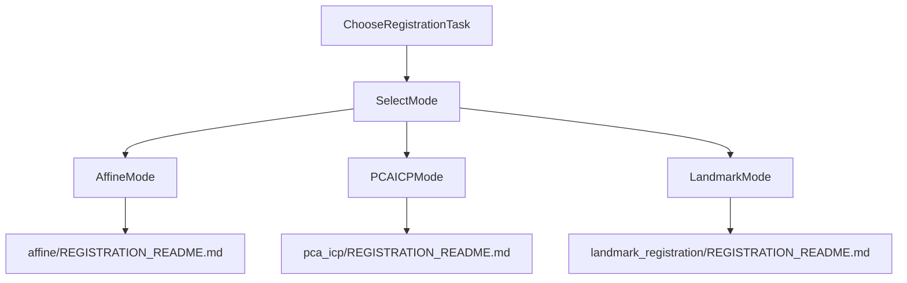

# Initial Registration Repository

This repository contains three registration workflows:

- `affine`: SimpleITK-based SDM + affine registration for CT/US kidney data (TRUSTED-style layout).
- `pca_icp`: VTK PCA + ICP registration for paired CT/US segmentations.
- `landmark_registration`: Landmark-based registration from MNI `.tag` files using a JSON manifest (default MRI -> US).

## Choose A Mode

Use this quick guide:

- You have CT/US images + masks and want SDM-driven affine registration: use `affine`.
- You have paired CT/US kidney masks and want PCA+ICP rigid/similarity/affine options: use `pca_icp`.
- You have landmark pairs in MNI `.tag` and want transform + TRE/LC2 reports: use `landmark_registration`.



## Prerequisites

- Python 3.10+ recommended.
- Run commands from repository root: `C:/Users/Gabriella/Documents/Initial_Registration`.
- Install mode-specific dependencies in your environment:
  - `affine`: SimpleITK, tqdm
  - `pca_icp`: vtk, nibabel, numpy, scipy
  - `landmark_registration`: numpy, scipy; optional nibabel for LC2 and optional vtk (NumPy fallback exists for transforms)

## Quick Start

### 1) Affine (TRUSTED CT/US)

Step 1 - validate metadata and generate SDMs:

```powershell
python affine/validate_and_generate_sdm.py --ct_img_dir "C:\path\to\TRUSTED\CT_DATA\CT_images" --us_img_dir "C:\path\to\TRUSTED\US_DATA\US_images" --ct_mask_dir "C:\path\to\TRUSTED\CT_DATA\CT_masks" --us_mask_dir "C:\path\to\TRUSTED\US_DATA\US_masks" --out_dir "C:\path\to\TRUSTED\sdms" --report_format json
```

Step 2 - run affine registration:

```powershell
python affine/run_affine_registration.py --sdm_dir "C:\path\to\TRUSTED\sdms" --ct_img_dir "C:\path\to\TRUSTED\CT_DATA\CT_images" --us_img_dir "C:\path\to\TRUSTED\US_DATA\US_images" --out_dir "C:\path\to\TRUSTED\aligned" --save_transform --transform_dir "C:\path\to\TRUSTED\transforms"
```

### 2) PCA + ICP (CT/US Masks)

Main registration:

```powershell
python -m pca_icp.run_pca_icp_registration --base_dir "C:\path\to\dataset_root" --out_dir "C:\path\to\output_reports" --icp_mode rigid
```

Optional: resample full CT into US space from a CT->US transform:

```powershell
python -m pca_icp.resample_ct_to_us --ct "C:\path\to\314L_imgCT.nii.gz" --us_reference "C:\path\to\dataset_root\US_masks\314L_maskUS.nii.gz" --tfm "C:\path\to\transforms\314L_CT_to_US_pca_icp.tfm" --out "C:\path\to\314L_CT_in_US_space.nii.gz"
```

Optional: crop CT images/masks by mask-centered XY crop:

```powershell
python -m pca_icp.crop_ct_by_mask --batch_root "C:\path\to\kidney_dataset\TRUSTED" --out_dir "C:\path\to\TRUSTED_cropped" --target_xy 512 512 --bbox_margin_xy 12 12
```

### 3) Landmark Registration (MNI `.tag`, JSON Manifest)

Main batch run:

```powershell
python -m landmark_registration.run_landmark_registration --manifest "C:\path\to\resect_manifest.json" --out_dir "C:\path\to\landmark_outputs" --model rigid
```

Manifest shape:

```json
{
  "cases": [
    {
      "case_id": "Case1",
      "tag_path": "C:/path/to/Case1-MRI-beforeUS.tag",
      "moving_image_path": "C:/path/to/Case1_MRI.nii.gz",
      "fixed_image_path": "C:/path/to/Case1_US.nii.gz"
    }
  ]
}
```

## Data Layout Expectations

- `affine`:
  - separate CT/US image and mask directories (TRUSTED naming convention).
  - examples: `{patient}{side}_imgCT.nii.gz`, `{patient}{side}_imgUS.nii.gz`, `{patient}{side}_seg.nii.gz`, `{patient}{side}_maskUS.nii.gz`.
- `pca_icp`:
  - `--base_dir/CT_masks` and `--base_dir/US_masks`.
  - case ids parsed as `(\d+[LR])_` from filenames.
- `landmark_registration`:
  - per-case MNI `.tag` paths in JSON manifest.
  - optional image paths for LC2 calculation.

## Outputs By Mode

- `affine`:
  - SDMs: `{key}_imgCT_sdm.nii.gz`, `{key}_imgUS_sdm.nii.gz`
  - aligned image: `{key}_US_aligned_to_CT.nii.gz`
  - transforms: `{key}_US_to_CT_affine.tfm`, `{key}_CT_to_US_affine.tfm`
- `pca_icp`:
  - per-case JSON reports with `pca_matrix`, `icp_matrix`, `final_matrix`, `resample_matrix`, Dice, diagnostics
  - optional `.tfm` exports and optional resampled NIfTI outputs
- `landmark_registration`:
  - `out_dir/matrices/*.txt` (4x4 moving->fixed matrix)
  - `out_dir/reports/*_landmark_report.json`
  - `out_dir/landmark_registration_summary.json`

## Transform Conventions (Important)

- `affine`: transform files follow Slicer/ITK parent-child naming conventions; file names can appear opposite to intuitive "direction". See `affine/REGISTRATION_README.md` transform section.
- `pca_icp`: homogeneous column-vector convention (`p_out_h = T @ p_in_h`). `final_matrix` is registration output; `resample_matrix` may differ depending on `--geometry_mode`.
- `landmark_registration`: homogeneous column-vector convention with explicit moving->fixed mapping:
  - `p_fixed_h = T_moving_to_fixed @ p_moving_h`

## Troubleshooting Highlights

- `pca_icp`: run module style from repo root (`python -m pca_icp.run_pca_icp_registration`) to avoid `types` import shadowing errors.
- `pca_icp` on managed Windows: VTK DLL loading can fail under AppLocker/application control policy.
- `landmark_registration`: LC2 is optional and skipped (with warning/status in report) if image paths are empty, missing, or invalid.
- `affine`: current docs reference `utils/...` script paths, while this checkout stores scripts under `affine/...`; if you see import path issues in affine scripts, consult `affine/REGISTRATION_README.md` and adjust invocation/environment accordingly.

## Detailed Documentation

- [Affine registration guide](affine/REGISTRATION_README.md)
- [PCA + ICP registration guide](pca_icp/REGISTRATION_README.md)
- [Landmark registration guide](landmark_registration/REGISTRATION_README.md)
